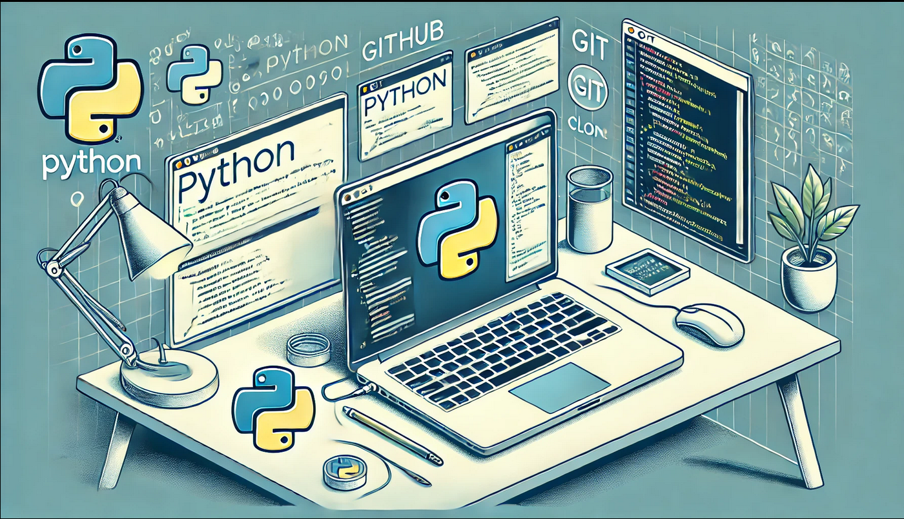
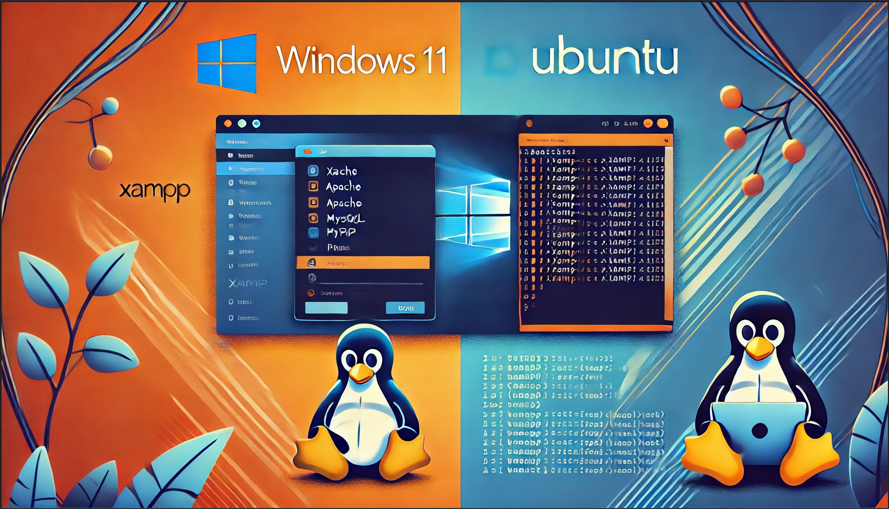

## Hola, me llamo Jorge Bernal Liarte.

Soy Jorge, soy un apasionado de la informática. Me gusta probar diferentes sistemas operativos y me llama la atención saber como protegerse sobre los diferentes de peligros en la seguridad, entre otras muchas cosas.

## Sobre mi.

 En 2021 empecé a formarme en el ámbito de la informática realizando el grado medio de Sistemas Microinformáticos y Redes o también conocido como (SMR), el cual me sirvió para ampliar mis conocimientos en este ámbito y en la actualidad estoy cursando el segundo año del grado superior Administración en Sistemas Informáticos en Red (ASIR) en el cual espero ampliar y profundizar mis conocimientos.

## Herramientas y Tecnologías que he utilizado alguna vez
 -💻<strong>Sistemas Operativos:</strong> Windows 10 y 11, Windows Server, Ubuntu, Ubuntu Server, Debian, Kali Linux y Kali Purple, MacOS, iOS y Linux Mint
  
 -⚒️<strong>Herramientas:</strong> Odoo, Worpress,Elementor, MySQL Workbench, Xampp, Nessus, CLARA, Lynis, Git, GitKraken, Github, Oracle Virtual Box, UTM, Visual Studio Code, ActiveDirectory, Clonecilla,Cisco Packet Tracer
  
 -⚒️<strong>Aplicaciones Varias:</strong> Google Drive, Gmail, Google Docs, Notion, Discord, Likedin, 

## Practicas 
<table>
<tr>
<td width="50%">
<h3 align="center">Curso Básico de Python</h3>

Este es un curso el cual lo estamos realizado en el modulo de <strong>SAD (Seguridad y Alta Disponibilidad)</strong> - En este curso se podrá ver los inicios para aprender <strong>Python</strong> con todo el código disponible para descargar y comentado para observar que hace cada cosa.

                                                                                      
</td>

<td width="50%">
<h3 align="center">Verificación de la Integridad de Archivos</h3>

Esta practica consiste en saber como comprobar la integridad de ficheros en so Windows y Ubuntu con herramientas tales como <strong>CertUtil, QuickHash GUI, md5sum y sha256sum. </strong>  

                                                             
</table>                                                                                 

 

<table>
<tr>
<td width="50%">
<h3 align="center"> Auditoria del Sistema</h3>

 
 

Esta practica consiste en la realización de auditorias en los sistemas operativos Windows 11 y Ubuntu 24.04 con <strong>Lynis,Nessus y CLARA </strong>.

                                                                                  
</td>       

<td width="50%">
<h3 align="center">Instalación y Configuración Básica de Xampp Windows y Ubuntu</h3>

 
 

Esta practica consiste en instalar y configurar mínimamente un servidor de aplicaciones web que en este caso va a ser <strong>XAMPP</strong> en los sistemas Windows 11 y Ubuntu 24.04.

                                                                                      
</td>  
</table>                                                                                 

 
